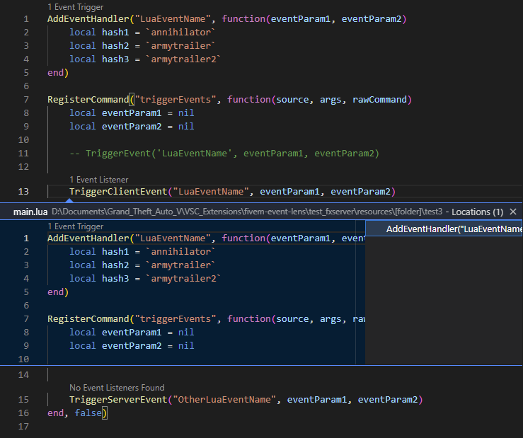
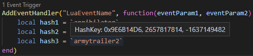

# FiveM event lens

FiveM event lens is an extension for [Visual Studio Code](https://code.visualstudio.com/) that adds CodeLenses to events.

## Features
- Find event triggers that match event listeners and listeners that match event triggers:

- Hover over backtick string to get the hash key of the string:

